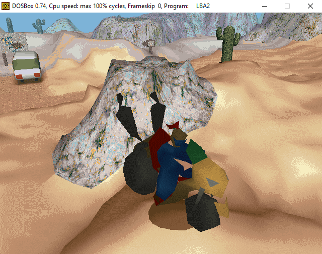
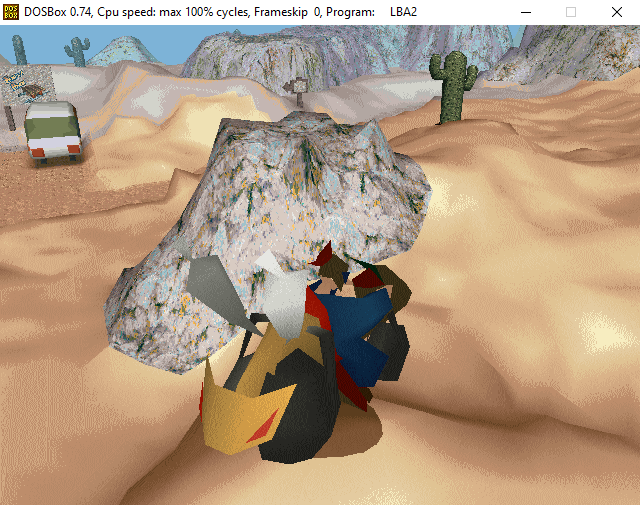

# LBA2: Blender to Model
This is a program to export a Blender model to the LBA2 model format. This is the first publicly released version of this Blender Python script and is far from perfect. It is also my longest piece of Python code to date. It was mainly intended for rigged models, but can definitely be used for static ones. Instructions on how to make models using the script are soon to come. There's simply too much to explain at the moment.

I owe a lot of credit to Xesf. Without his documentation on the LBA2 model format, none of this would have been possible. Here is the link to his notes on the LBA2 model format: http://lbafileinfo.kazekr.net/index.php?title=LBA2:3D_model.

To use your model in Little Big Adventure 2 (Twinsen's Odyssey) game, use Zink's LBA Package Editor program from the https://www.magicball.net/ website. Here is the exact link: https://www.magicball.net/downloads/programs/development/lba_package_editor. Replace any entry that uses a model file, and build the HQR output to the same HQR file. You should see the model at that location in the game.

This has only been written and tested on Windows 10 with Blender 2.79b. If you plan to port it to other operating systems in other languages, please do - just be sure to let me know. I don't know much about licensing, but all permission to port is welcome.

Features that still need to be added:

- Full LBA2 color palette
- Textured triangles
- Colored quadrilaterals
- Textured quadrilaterals
- Different render types
- Animation support
- Animation preview

Some examples from using the above program (Twinsen on a motorcycle):

